# matconnect

Say you have infrastructure deployed in the above architecture for some reason.
Typically you might expect that connectivity between **A** and **B** isn't
possible - `ping` and `netcat` both fail to yield responses after all.

It turns out that if an instance has a public IP address in a VPC with an
internet gateway attached it can _receive_ traffic - it just can't respond
to it. This is because response packets are routed via the subnet's route table
and would transit via the NAT GW with a different IP.

But what if we were to do something really silly. Could we make it work then?
Enter `matconnect`.

`matconnect` works by combining two physical unidirectional streams (A->B and B->A)
into a single logical stream via shenanigans. This works via UDP's ability to
send/receive over "unconnected sockets". At the start of each UDP "session" we
send a six byte packet with the client's public IP address and port that it expects
to receive a response on. Then we proceed with the application protocol itself. 
In this case, we use HTTP/3 to get TLS 1.3  encryption (can't have our nonsense 
be _insecure_). On top of HTTP/3 we use WebTransport for multiplexing arbitrary 
bidirectional streams. And on one of those bidirectional streams we have our 
client and server sing a duet. It looks like this:

```mermaid
sequenceDiagram
    participant A as Instance A
    participant NA as NAT GW A
    participant NB as NAT GW B
    participant B as Instance B
    A->>NA: From 10.0.0.1:49152<br>To 9.8.7.6:8080<br> "I am listening on 1.2.3.4:49152 ... ${payload}"
    NA->>B: From 5.6.7.8:63122<br>To 9.8.7.6:8080<br> "I am listening on 1.2.3.4:49152 ... ${payload}"
    Note left of B: Normally a response now <br>would go to 5.6.7.8:63122. <br> But we read our silly header <br> and "open a new connection" 😉
    B->>NB: From 10.0.0.6:54321<br>To 1.2.3.4:49152<br> ${response payload}
    NB->>A: From 4.3.2.1:19387<br>To 1.2.3.4:49152<br> ${response payload}
```

And the result is beautiful:

## Usage

On one instance (that we'll call the server), run `./matconnect`. On the other instance
(which we'll call the client), run `./matconnect <server public ip>:8080`. Now watch 
the important data flow in both directions.
